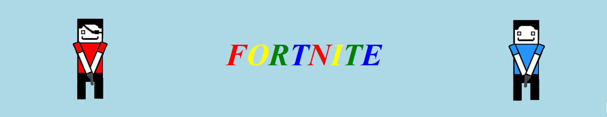

# Fortnighty

The fortnite from the 90s

Link to the website: https://pauldubois98.github.io/Fortnighty/index.html

Goal of this hackathon (Porticode 3.0) was to create a website of an recent company and how their site would have looked like in 1990's (retro look).
Therefore, we have purposely adding spams and funky background and lag for this look.
Feel free to play around with it and add your comments in the forum. 
